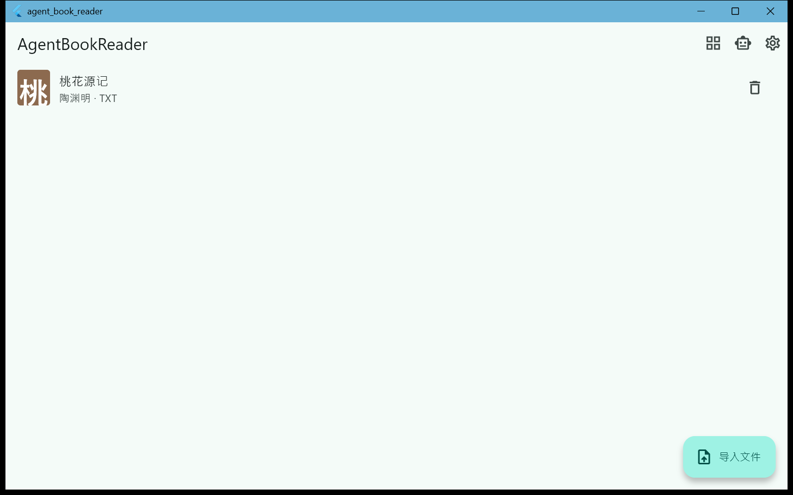
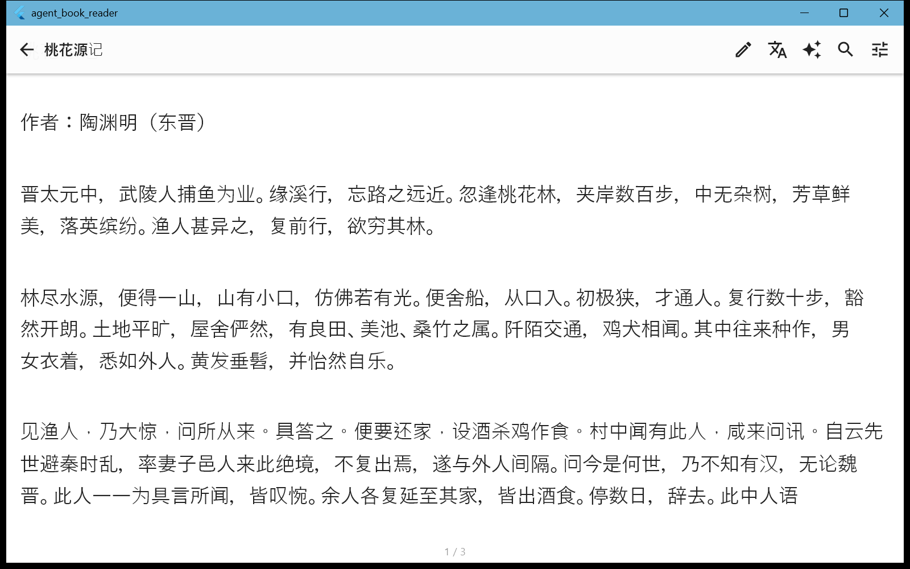

# AgentBookReader

跨平台电子书阅读器（Windows / Android / iOS / Linux），内置 AI Agent（对话问答、批注、改写提案）与多提供方翻译（整页 / 选块）。

## 界面预览

| 书库 | 阅读页（分页排版） |
| --- | --- |
|  |  |

## 功能特性

- **格式支持** — TXT / Markdown / JSON / DOCX / EPUB / PDF（pdfrx）；打开文件自动探测编码（BOM → UTF-8 → GBK → UTF-16 启发式），GBK 老书不会乱码
- **阅读体验** — TextPainter 行级度量的精确分页（段落跨页、样式随行切片）、阅读进度记忆、章节目录跳转
- **AI Agent** — 对话式问答 + 工具循环（maxTurns=8）：`get_outline` / `read_section` / `search_text` / `add_annotation` / `propose_rewrite`；改写永远走「提案 → 确认」，不直接改文件（txt/md/json 确认后写回并备份 `.bak`）
- **翻译** — 整篇翻译一键任务，多提供方：LLM、MyMemory（免费无 Key，450 字分块）、Google gtx；结果按（文档, 段落, 语言）缓存进数据库，可导出 `<原名>.<lang>.md`
- **批注系统** — 高亮 / 批注 / 改写提案统一挂在「全文偏移坐标系」上，进度、Agent 引用、批注共用同一基准

## 技术栈

- **UI**：Flutter（Material 3）+ Riverpod
- **数据**：drift（SQLite）——书库、批注、Agent 会话、翻译缓存
- **核心层纯 Dart**：DocumentParser 五格式提取器、Paginator 分页器、编码探测、Agent 工具循环均与 UI 解耦，可单测（42 项自动化测试）

## 开发

```bash
flutter pub get
flutter analyze   # 0 问题基线
flutter test      # 全部通过
flutter build windows --release
```

- 支持平台：Windows ✅ / Android ✅（APK 构建通过）；iOS、Linux 规划中
- AI / 翻译功能在应用内「设置 → Agent 设置」配置自己的 API（OpenAI 兼容接口）
